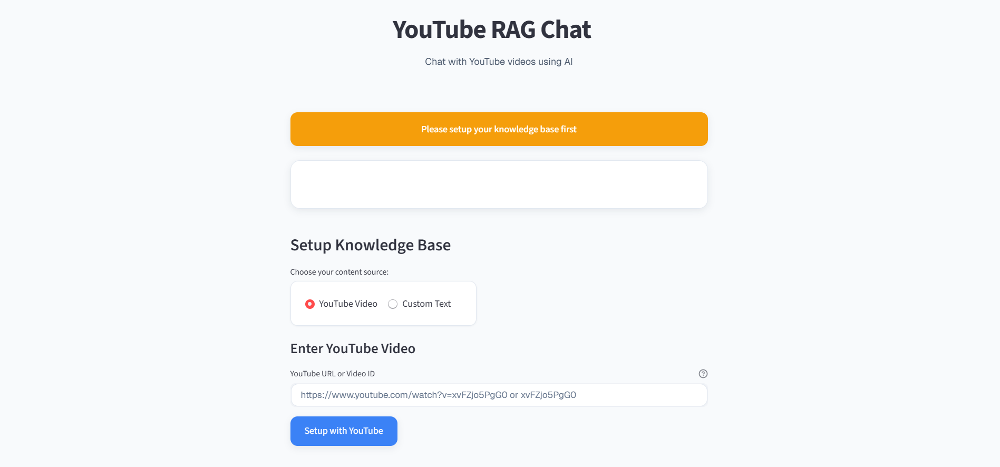
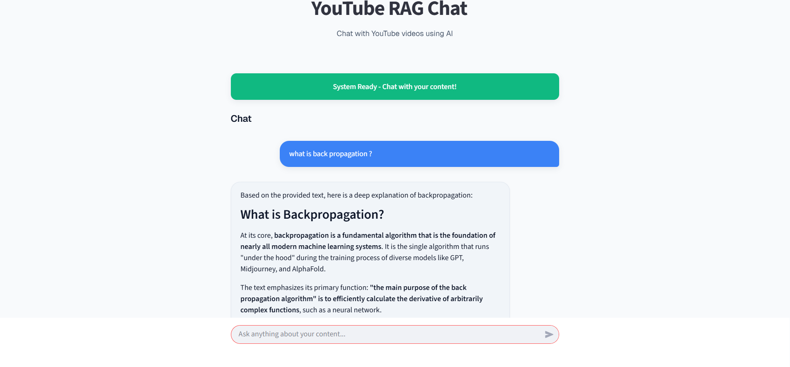

# TUBESAGE
Chat with YouTube videos using AI

  
  
  
  

TubeSage is a powerful AI-powered RAG (Retrieval-Augmented Generation) system that lets you chat with the contents of a YouTube video or custom text. It extracts transcripts, builds a vector store, and answers your questions in a conversational format — powered by Google's Gemini Pro and HuggingFace embeddings.

### Key Features
- Extracts transcripts directly from YouTube videos.

- Enables conversational Q&A using LangChain and Google Gemini Pro.

- Supports custom text input as an alternative to YouTube.

- Maintains contextual memory of previous conversations.

- FastAPI backend with a clean and interactive Streamlit frontend.

### How it Works
1. Transcript Extraction:
 Pulls transcript from a YouTube video using youtube-transcript-api.

2. Text Chunking: 
 Breaks long text into overlapping chunks using RecursiveCharacterTextSplitter.

3. Embedding & Vectorization:
 Uses sentence-transformers/all-MiniLM-L6-v2 for creating embeddings. Vector store is built using FAISS.

4. RAG Pipeline:
 Combines Google Gemini (via LangChain) with your video/text context using a prompt template.

5. Memory System:
 Stores up to 10 past interactions to maintain context.
